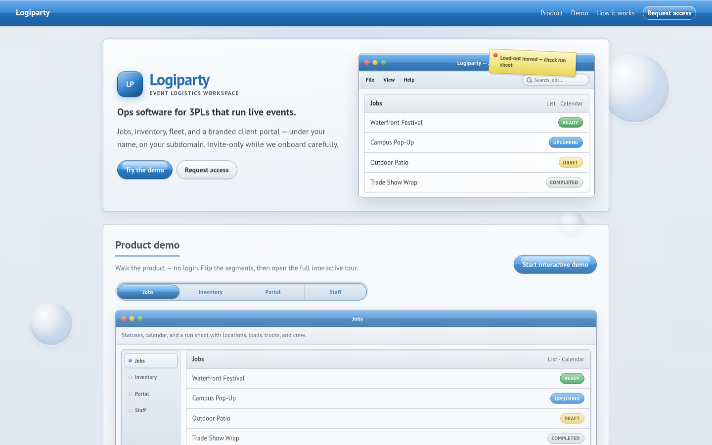

# Logiparty

Logiparty is a multi-tenant web app for third-party logistics (3PL) companies that run warehouse, fleet and crew for live events, deliveries and corporate jobs. Each company gets its own workspace on its own subdomain, plus a white-label portal where its clients can request jobs and see their own inventory.

Live at [logiparty.com](https://logiparty.com). A demo tenant login is at [test.logiparty.com](https://test.logiparty.com/login).



## What it does

- Invite-only accounts with four roles: org admin, manager, staff and client. Staff can carry capability tags such as driver or warehouse.
- Jobs are the unit of work. A job holds inventory lines, vehicles, crew, up to five locations, documents and an activity trail. Status moves from draft to upcoming to ready to completed (or denied).
- Client portal: clients request jobs, upload PDFs and images, and only see their own company's jobs and inventory.
- Separate catalogs for client-owned inventory, the 3PL's own inventory and the fleet. Items and vehicles are locked while a job is upcoming or ready and released after load-out.
- Documents are stored in Cloudflare R2 and served with signed URLs.
- Time-off requests that managers approve, and an activity log scoped by role.
- White-label settings per org: name, logo, primary color and email from-name.
- Stripe billing is scaffolded (checkout, portal, webhook) but off unless the keys are set.

## Stack

Next.js 15 (App Router), React 19, Tailwind CSS 4, shadcn/ui, NextAuth v5, Drizzle ORM on Neon Postgres with row-level security, Cloudflare R2, Resend, deployed on Vercel.

## Running it locally

You need Node.js 20 or newer and a Postgres database (a free Neon project works).

1. Install dependencies with `npm install`.
2. Copy `.env.example` to `.env.local` and fill in at least `DATABASE_URL` and `AUTH_SECRET` (generate one with `openssl rand -base64 32`). R2, Resend and Stripe are optional for local work.
3. Tenants are picked by subdomain, so add these to `/etc/hosts`:

   ```
   127.0.0.1 nydac.localhost
   127.0.0.1 test.localhost
   127.0.0.1 axis.localhost
   ```

4. Apply the migrations and seed the demo orgs:

   ```sh
   npm run db:migrate:sql
   npm run db:seed
   ```

5. Start the dev server with `npm run dev` and open `http://nydac.localhost:3000`.

The seed script creates three demo organizations with sample users. The demo accounts and their shared password are listed in `docs/GETTING_STARTED.md`. They are local test data only.

Other scripts you might need: `npm run db:reset-seed -- --confirm` to wipe and reseed, `npm run test:integration` for the integration checks, and `npm run db:verify-rls` to check the row-level security policies.

See [docs/how-it-works.md](docs/how-it-works.md) for how tenant routing, row-level security and the job lock rules fit together.

## Project layout

- `app/` routes: the marketing site, `dashboard/` for staff, `portal/` for clients, `demo/`, and `api/`
- `lib/` server code: auth, database schema and migrations, jobs, inventory, storage, email
- `docs/` schema notes, decisions, staging setup and the open task list
- `scripts/` migration, seed and test scripts

Logiparty grew out of an earlier school project, [thirdpartylogistics](https://github.com/jakedcl/thirdpartylogistics).

## Status

The MVP milestones are built and the app is running in production. Onboarding is by hand for now rather than public signup. Remaining work is tracked in `docs/OPEN_TABS.md`.

## License

Private, all rights reserved.
