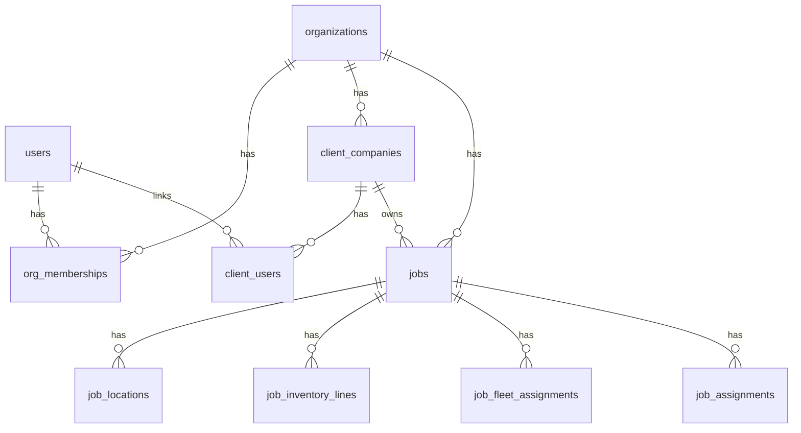

# SCHEMA.md — Logiparty database

Source of truth for Drizzle schema and RLS. **Agents must not invent tables or columns not listed here** without updating this file.

All `id` fields are UUID v4 unless noted. All timestamps are `timestamptz`.

---

## Enums

```ts
org_role: 'OrgAdmin' | 'Manager' | 'Staff' | 'Client'
job_status: 'draft' | 'upcoming' | 'ready' | 'completed' | 'denied'
assignment_phase: 'LoadIn' | 'LoadOut'
assignment_role: 'Driver' | 'Laborer' | 'Lead'
job_inventory_item_type: 'client' | 'org'
availability_status: 'Pending' | 'Approved' | 'Denied'
uploader_role: 'manager' | 'client'
inventory_request_type: 'add' | 'qty_change' | 'remove'
inventory_request_status: 'pending' | 'approved' | 'denied'
```

*Client notes have no enum — unread = `read_at IS NULL`.*

Staff capability tags (string slugs): `driver`, `warehouse`, `forklift`, `lead`, `rigger`, `staging`

---

## Core tenancy

### `organizations`
| Column | Type | Notes |
|--------|------|-------|
| id | uuid PK | |
| slug | text UNIQUE | Subdomain: `{slug}.logiparty.com` |
| name | text | Display name |
| logo_url | text | Nullable |
| primary_color | text | Hex, e.g. `#2563eb` |
| email_from_name | text | Legacy / unused by UI — outbound mail uses `name` (`email_from_name ?? name` fallback in mailer) |
| stripe_customer_id | text | Nullable — Stripe Customer for org billing |
| stripe_subscription_id | text | Nullable — Stripe Subscription id |
| billing_status | text | Nullable soft gate: `none` \| `active` \| `past_due` \| `canceled` (no hard lockout in pilot) |
| created_at | timestamptz | |

### `users`
| Column | Type | Notes |
|--------|------|-------|
| id | uuid PK | Global identity |
| email | text UNIQUE | |
| password_hash | text | Nullable if OAuth later |
| first_name | text | |
| last_name | text | |
| created_at | timestamptz | |

### `org_memberships`
| Column | Type | Notes |
|--------|------|-------|
| id | uuid PK | |
| org_id | uuid FK → organizations | |
| user_id | uuid FK → users | UNIQUE(org_id, user_id) |
| role | org_role | Primary role |
| is_staff | boolean | If true, eligible for crew picker |
| is_manager | boolean | If true, manager permissions |
| is_org_admin | boolean | If true, org admin permissions |
| is_client | boolean | If true, portal only |
| created_at | timestamptz | |

*Note: A user can be `is_manager` and `is_staff` together. Crew picker includes only `is_staff = true`.*
*FK: `org_id` → organizations **ON DELETE CASCADE** (deleting an org removes memberships). `user_id` → users **ON DELETE CASCADE**. Deleting an org does **not** delete `users` rows — orphaned users must be deleted explicitly (see `db:reset-seed`).*

### `staff_capability_tags`
| Column | Type | Notes |
|--------|------|-------|
| membership_id | uuid FK → org_memberships | |
| tag | text | e.g. `warehouse` |
| PK | (membership_id, tag) | |

---

## Client companies

### `client_companies`
| Column | Type | Notes |
|--------|------|-------|
| id | uuid PK | |
| org_id | uuid FK | RLS |
| name | text | e.g. "Red Bull" |
| created_at | timestamptz | |

### `client_users`
| Column | Type | Notes |
|--------|------|-------|
| id | uuid PK | |
| org_id | uuid FK | RLS |
| client_company_id | uuid FK | |
| user_id | uuid FK → users | |
| title | text | Job title at company |
| created_at | timestamptz | |

---

## Catalogs

### `inventory_items` (our inventory / Equipment tab)
| Column | Type | Notes |
|--------|------|-------|
| id | uuid PK | |
| org_id | uuid FK | RLS |
| sku | text | |
| name | text | |
| description | text | |
| total_quantity | int | |
| created_at | timestamptz | |

3PL-owned gear (dollies, hand tools, general stock). UI label: **Equipment** (Inventory hub). Not fleet; not client-owned assets.

### `client_inventory_items`
| Column | Type | Notes |
|--------|------|-------|
| id | uuid PK | |
| org_id | uuid FK | RLS |
| client_company_id | uuid FK | |
| sku | text | |
| name | text | |
| description | text | |
| total_quantity | int | |
| created_at | timestamptz | |

Clients do **not** edit this catalog directly. They submit rows in `client_inventory_requests`; managers approve (apply) or deny.

### `client_inventory_requests`
| Column | Type | Notes |
|--------|------|-------|
| id | uuid PK | |
| org_id | uuid FK | RLS |
| client_company_id | uuid FK | |
| requested_by_user_id | uuid FK → users | Client who submitted |
| type | inventory_request_type | `add` \| `qty_change` \| `remove` |
| client_inventory_item_id | uuid FK → client_inventory_items | Nullable; required for qty/remove |
| proposed_sku | text | Nullable; used for `add` |
| proposed_name | text | Nullable; used for `add` |
| proposed_description | text | Nullable; used for `add` |
| proposed_quantity | int | Nullable; used for `add` / `qty_change` |
| reason | text | Required — why the change |
| status | inventory_request_status | `pending` \| `approved` \| `denied` |
| reviewer_user_id | uuid FK → users | Nullable until reviewed |
| reviewed_at | timestamptz | Nullable |
| review_note | text | Optional manager note (esp. deny) |
| created_at | timestamptz | |
| updated_at | timestamptz | |

*Approve applies to `client_inventory_items`: `add` inserts a row; `qty_change` updates `total_quantity`; `remove` deletes the catalog row (same as staff delete). Deny only updates status + review fields.*

### `client_notes`
| Column | Type | Notes |
|--------|------|-------|
| id | uuid PK | |
| org_id | uuid FK | RLS |
| client_company_id | uuid FK | |
| sent_by_user_id | uuid FK → users | Client who sent |
| subject | text | Optional |
| body | text | Required |
| read_at | timestamptz | Nullable — null = unread (staff inbox) |
| read_by_user_id | uuid FK → users | Nullable until a manager marks read |
| created_at | timestamptz | |

*One-way v1: client → 3PL only. Not tied to a job or inventory SKU. No threading. Managers/OrgAdmins see unread in Notifications and can mark read.*

### `fleet_vehicles`
| Column | Type | Notes |
|--------|------|-------|
| id | uuid PK | |
| org_id | uuid FK | RLS |
| name | text | e.g. "Box Truck 12" |
| plate | text | Nullable |
| description | text | |
| is_active | boolean | default true |
| created_at | timestamptz | |

### `tools` *(deprecated — do not use)*

**Deprecated:** v1 unified hand tools and small equipment into `inventory_items` ("Our inventory"). Table kept in DB for migration safety; no app reads/writes.

| Column | Type | Notes |
|--------|------|-------|
| id | uuid PK | |
| org_id | uuid FK | RLS |
| sku | text | Nullable |
| name | text | |
| total_quantity | int | default 1 |
| created_at | timestamptz | |

---

## Jobs

### `jobs`
| Column | Type | Notes |
|--------|------|-------|
| id | uuid PK | |
| org_id | uuid FK | RLS |
| client_company_id | uuid FK | |
| name | text | |
| status | job_status | |
| job_start | timestamptz | |
| job_end | timestamptz | |
| load_in_start | timestamptz | |
| load_in_end | timestamptz | |
| load_out_start | timestamptz | |
| load_out_end | timestamptz | |
| client_poc_name | text | |
| client_poc_phone | text | |
| job_lead_user_id | uuid FK → users | Nullable |
| notes | text | |
| created_by | uuid FK → users | |
| created_at | timestamptz | |
| updated_at | timestamptz | |

### `job_locations`
| Column | Type | Notes |
|--------|------|-------|
| id | uuid PK | |
| job_id | uuid FK | CASCADE |
| org_id | uuid FK | Denormalized for RLS |
| label | text | |
| address | text | |
| sort_order | int | 0–4, max 5 rows per job |

### `job_inventory_lines`
| Column | Type | Notes |
|--------|------|-------|
| id | uuid PK | |
| job_id | uuid FK | |
| org_id | uuid FK | RLS |
| item_type | job_inventory_item_type | |
| client_item_id | uuid | Nullable FK → client_inventory_items |
| org_item_id | uuid | Nullable FK → inventory_items |
| quantity_assigned | int | |
| quantity_loaded | int | default 0 |

### `job_fleet_assignments`
| Column | Type | Notes |
|--------|------|-------|
| job_id | uuid FK | |
| fleet_vehicle_id | uuid FK | |
| org_id | uuid FK | RLS |
| PK | (job_id, fleet_vehicle_id) | |

### `job_assignments`
| Column | Type | Notes |
|--------|------|-------|
| id | uuid PK | |
| job_id | uuid FK | |
| org_id | uuid FK | RLS |
| user_id | uuid FK → users | |
| phase | assignment_phase | |
| assigned_role | assignment_role | |
| created_at | timestamptz | |
| UNIQUE | (job_id, user_id, phase) | |

---

## Invites

### `invites`
| Column | Type | Notes |
|--------|------|-------|
| id | uuid PK | |
| org_id | uuid FK | |
| email | text | |
| token | text UNIQUE | |
| role | org_role | |
| is_staff | boolean | |
| is_manager | boolean | |
| client_company_id | uuid | Nullable |
| expires_at | timestamptz | |
| accepted_at | timestamptz | Nullable |
| created_at | timestamptz | |

---

## Documents

### `documents`
| Column | Type | Notes |
|--------|------|-------|
| id | uuid PK | |
| org_id | uuid FK | RLS |
| job_id | uuid FK | |
| uploaded_by | uuid FK → users | |
| uploader_role | uploader_role | |
| file_name | text | |
| storage_key | text | R2 key |
| file_size_bytes | int | |
| mime_type | text | |
| created_at | timestamptz | |

---

## Availability (M5)

### `availability_requests`
| Column | Type | Notes |
|--------|------|-------|
| id | uuid PK | |
| org_id | uuid FK | RLS |
| user_id | uuid FK | |
| start_time | timestamptz | |
| end_time | timestamptz | |
| reason | text | |
| status | availability_status | |
| reviewed_by | uuid | Nullable |
| created_at | timestamptz | |

---

## Activity

### `activity_logs`
| Column | Type | Notes |
|--------|------|-------|
| id | uuid PK | |
| org_id | uuid FK | RLS |
| job_id | uuid | Nullable |
| user_id | uuid FK | |
| action | text | Human-readable |
| entity_type | text | |
| entity_id | uuid | |
| metadata | jsonb | |
| is_client_visible | boolean | default false |
| created_at | timestamptz | |

---

## Platform marketing (A3)

### `marketing_leads`
| Column | Type | Notes |
|--------|------|-------|
| id | uuid PK | |
| name | text | |
| email | text | |
| company | text | Nullable |
| message | text | Nullable |
| created_at | timestamptz | |

*Not org-scoped — no RLS. Apex `logiparty.com` waitlist / access requests. Optional Resend notify via `LEADS_NOTIFY_EMAIL`.*

---

## Lock model (application logic)

| Resource | Locked when | Released when |
|----------|-------------|---------------|
| Inventory units (assigned qty) | Job status `upcoming` or `ready` | `load_out_end` < now OR job `completed` |
| Fleet vehicle | Assigned to job in `upcoming` or `ready` | Same |

**Conflict rule:** Cannot assign/load more units than `total_quantity - locked_qty_other_jobs`.

**Implementation:** `lib/jobs/lock-window.ts` (`lockActiveConditions`) is shared by inventory and fleet lock queries. Release is evaluated at read/assign time — no separate unlock job required.

---

## RLS pattern

Every table with `org_id`:

```sql
ALTER TABLE {table} ENABLE ROW LEVEL SECURITY;
CREATE POLICY org_isolation ON {table}
  USING (org_id = current_setting('app.current_org_id', true)::uuid);
```

**Session setup (per request):**

```sql
SELECT set_config('app.current_org_id', '{orgUuid}', true);
```

Job-scoped tables (`job_assignments`, etc.) also enforce app-layer filters for staff (assigned jobs) and clients (company jobs). RLS alone is org-level; role scoping is in `lib/auth/permissions.ts` + queries.

---

## ER diagram (simplified)


